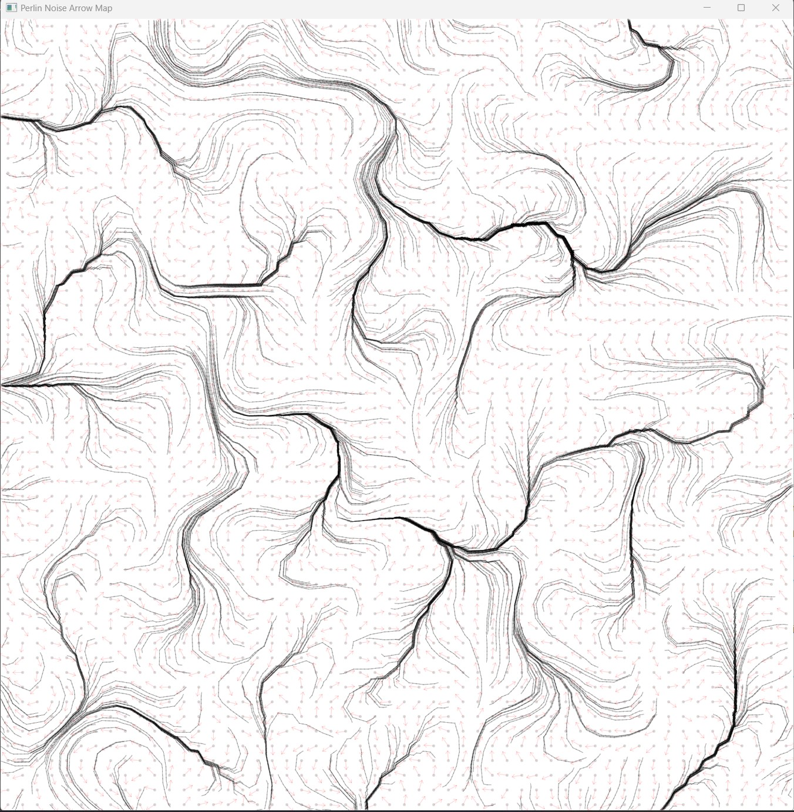
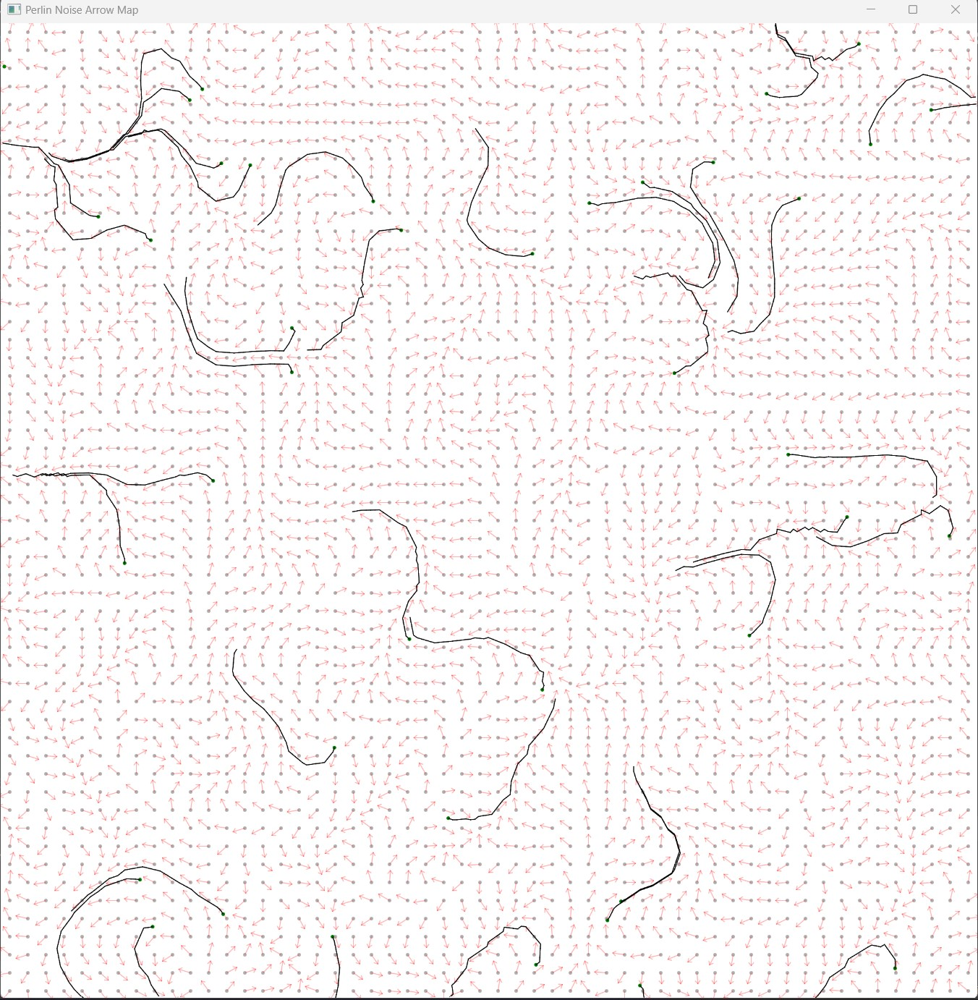
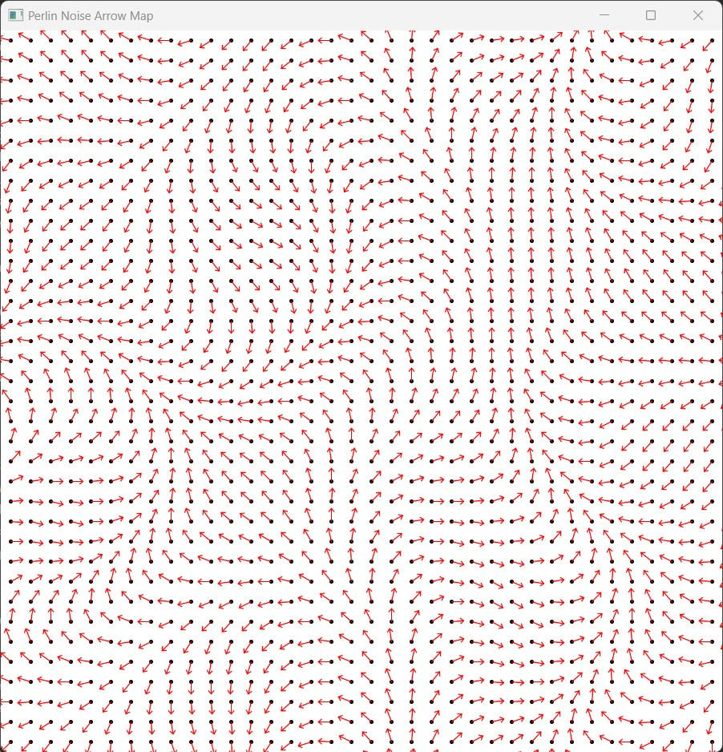
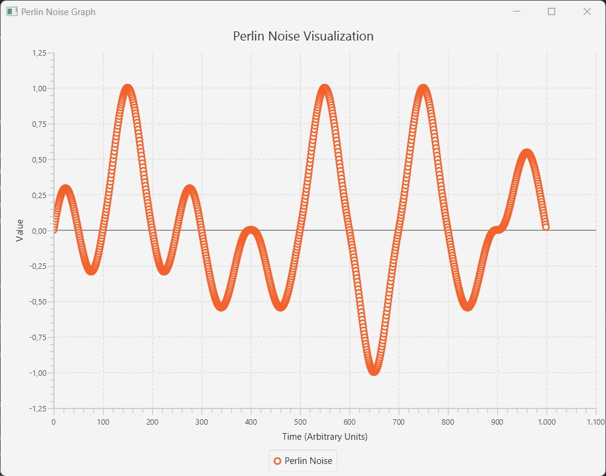
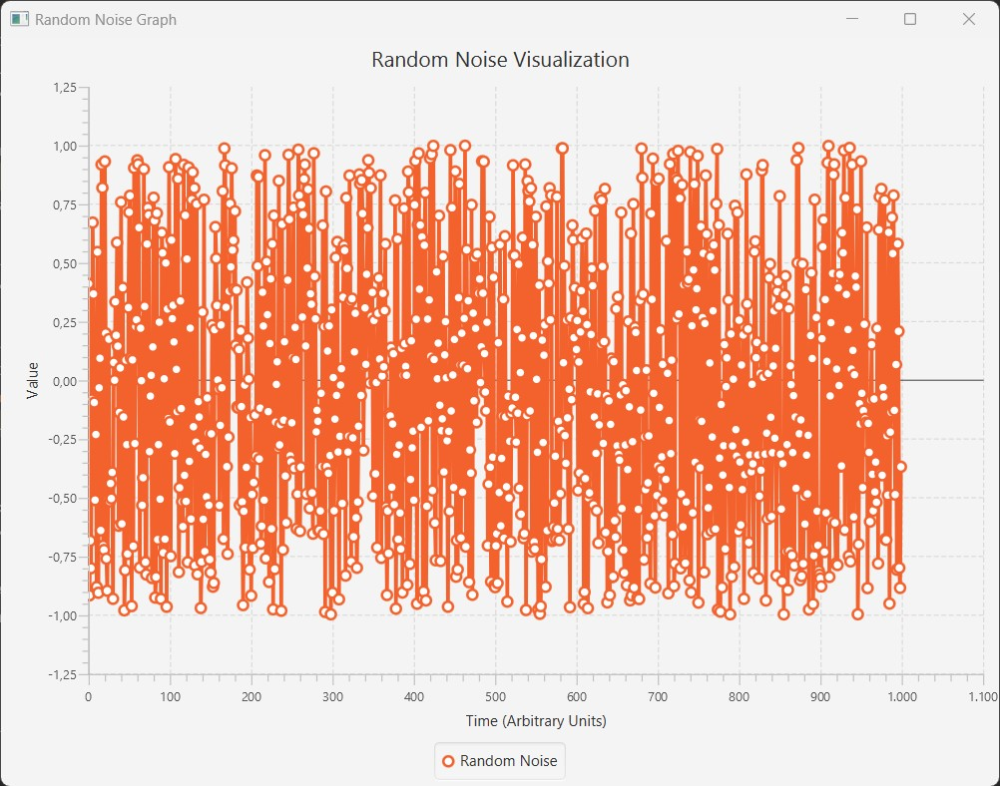

<h1>Artistic Explorations with Perlin Noise</h1>

<h3>Perlin Noise Fields using an arrow map</h3>

<h3>Graph comparison between regular noise and perlin noise</h3>

<h3>Perlin noise animation gif</h3>

